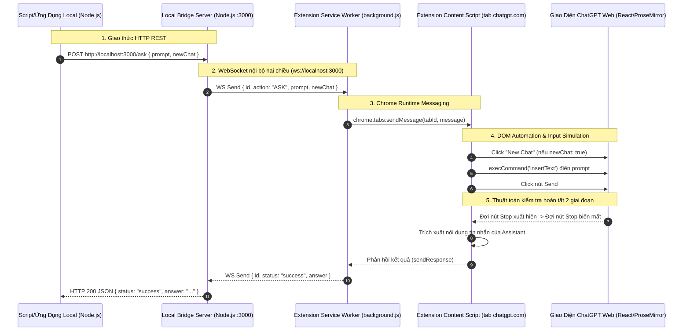

# Kế Hoạch Triển Khai Toàn Diện: Cầu Nối Điều Khiển ChatGPT Web Qua Chrome Extension (100% JavaScript)

Tài liệu này tổng hợp toàn bộ kế hoạch kỹ thuật, kiến trúc, phân tích rủi ro, xử lý lỗi tiềm ẩn và toàn bộ mã nguồn sẵn sàng chạy (Production-Ready) cho giải pháp điều khiển ChatGPT Web từ máy tính thông qua Chrome Extension.

---

## 1. Mục Tiêu & Nguyên Lý Hoạt Động

### Mục tiêu
- Gửi prompt và nhận câu trả lời từ bất kỳ script/chương trình Node.js nào trên máy tính cá nhân.
- Tận dụng phiên đăng nhập và gói tài khoản ChatGPT (Plus / Free) đang có sẵn trên trình duyệt.
- Không phát sinh chi phí OpenAI API per-token, không cần API Key.
- Sử dụng **100% JavaScript** (Node.js cho server máy tính, Vanilla JS cho Chrome Extension).

### Kiến Trúc 3 Tầng Khép Kín (Three-Tier Architecture)



---

## 2. Báo Cáo Phân Tích & Khắc Phục 5 Bug Tiềm Ẩn Thực Tế

Trong môi trường thực tế, nếu chỉ làm extension theo mẫu thông thường sẽ gặp 5 vấn đề lớn sau:

| STT | Vấn đề / Bug tiềm ẩn | Nguyên nhân kỹ thuật | Giải pháp đã khắc phục trong mã nguồn |
| :---: | :--- | :--- | :--- |
| **1** | **Mất kết nối WebSocket sau 30s** | Chrome Manifest V3 tự động cho Service Worker ngủ (`idle timeout`) sau 30 giây không có sự kiện. | Dùng `chrome.alarms` tạo nhịp tim định kỳ mỗi 20 giây để đánh thức và duy trì socket. |
| **2** | **Nút Send bị xám, mất chữ** | ChatGPT dùng editor ProseMirror/Lexical với React state. Gán `innerHTML` hoặc `value` không kích hoạt state React. | Dùng `document.execCommand('insertText', false, text)` để mô phỏng sự kiện bàn phím người dùng thật. |
| **3** | **Trả về văn bản rỗng / vội vã** | Sau khi bấm Send, mất 0.5s - 1.5s nút `Stop generating` mới hiện ra. Nếu check ngay sẽ tưởng đã xong. | Thuật toán 2 giai đoạn: Bắt buộc đợi nút Stop hiện diện $\rightarrow$ sau đó đợi nút Stop biến mất và text ổn định. |
| **4** | **Tràn ngữ cảnh (Context Bloat)** | Chat liên tiếp nhiều câu hỏi độc lập vào cùng 1 đoạn hội thoại gây chậm và lẫn lộn context. | Tích hợp tham số `newChat: true` để tự động làm mới hội thoại trước khi hỏi. |
| **5** | **Tab bị đóng băng (Memory Saver)** | Chrome cho tab chạy nền ngủ đông để tiết kiệm RAM, khiến script ngừng chạy. | Tự động kích hoạt nhẹ tab (`chrome.tabs.update`) trước khi thực hiện thao tác. |

---

## 3. Cấu Trúc Thư Mục Dự Án

```
chatgpt-web-bridge/
├── server/
│   ├── package.json
│   ├── server.js              # HTTP REST + WebSocket Server
│   └── test-ask.js            # Script mẫu test hỏi 1 câu
│   └── test-batch.js          # Script mẫu test hỏi hàng loạt câu hỏi
└── extension/
    ├── manifest.json          # Manifest V3
    ├── background.js          # Quản lý WebSocket & Service Worker Keep-alive
    ├── content.js             # Nhúng vào chatgpt.com, tự động hóa DOM
    ├── popup.html             # UI thông báo trạng thái
    └── popup.js
```

---

## 4. Toàn Bộ Mã Nguồn Chuẩn Production (100% JavaScript)

### 4.1. Phía Server (`server/`)

#### File: `server/package.json`
```json
{
  "name": "chatgpt-local-bridge-server",
  "version": "1.0.0",
  "description": "Local HTTP to Chrome Extension WebSocket Bridge for ChatGPT Web",
  "main": "server.js",
  "scripts": {
    "start": "node server.js"
  },
  "dependencies": {
    "express": "^4.19.2",
    "ws": "^8.18.0"
  }
}
```

#### File: `server/server.js`
```javascript
const express = require('express');
const http = require('http');
const { WebSocketServer } = require('ws');

const app = express();
app.use(express.json({ limit: '50mb' }));

const server = http.createServer(app);
const wss = new WebSocketServer({ server });

let currentExtensionWs = null;
const pendingRequests = new Map();

// 1. Quản lý kết nối WebSocket với Extension
wss.on('connection', (ws) => {
  console.log('✅ [Bridge Server] Chrome Extension đã kết nối WebSocket!');
  currentExtensionWs = ws;

  ws.on('message', (raw) => {
    try {
      const data = JSON.parse(raw.toString());

      // Bỏ qua heartbeat keep-alive
      if (data.action === 'HEARTBEAT') {
        return;
      }

      // Xử lý kết quả trả về từ Extension
      if (data.id && pendingRequests.has(data.id)) {
        const { resolve } = pendingRequests.get(data.id);
        pendingRequests.delete(data.id);
        resolve(data);
      }
    } catch (e) {
      console.error('❌ Lỗi xử lý message từ Extension:', e.message);
    }
  });

  ws.on('close', () => {
    console.log('⚠️ [Bridge Server] Chrome Extension đã ngắt kết nối.');
    if (currentExtensionWs === ws) {
      currentExtensionWs = null;
    }
  });
});

// 2. API Endpoint tiếp nhận câu hỏi từ ứng dụng trên máy
app.post('/ask', async (req, res) => {
  const { prompt, newChat = false, timeout = 180000 } = req.body;

  if (!prompt || typeof prompt !== 'string') {
    return res.status(400).json({ error: 'Tham số "prompt" là bắt buộc và phải là chuỗi.' });
  }

  if (!currentExtensionWs || currentExtensionWs.readyState !== 1) {
    return res.status(503).json({
      error: 'Chrome Extension chưa kết nối hoặc chưa mở tab https://chatgpt.com'
    });
  }

  const requestId = 'req_' + Date.now() + '_' + Math.random().toString(36).substring(2, 7);

  const requestTask = new Promise((resolve, reject) => {
    const timer = setTimeout(() => {
      pendingRequests.delete(requestId);
      reject(new Error(`Timeout: Quá thời gian chờ phản hồi (${timeout / 1000}s)`));
    }, timeout);

    pendingRequests.set(requestId, {
      resolve: (data) => {
        clearTimeout(timer);
        resolve(data);
      }
    });
  });

  try {
    // Chuyển tiếp câu hỏi sang Extension
    currentExtensionWs.send(JSON.stringify({
      id: requestId,
      action: 'ASK',
      prompt,
      newChat
    }));

    const result = await requestTask;
    return res.json(result);
  } catch (error) {
    return res.status(500).json({ error: error.message });
  }
});

// 3. API kiểm tra tình trạng kết nối
app.get('/status', (req, res) => {
  res.json({
    connected: currentExtensionWs !== null && currentExtensionWs.readyState === 1,
    pendingCount: pendingRequests.size
  });
});

const PORT = 3000;
server.listen(PORT, () => {
  console.log(`====================================================`);
  console.log(`🚀 ChatGPT Bridge Server đang chạy: http://localhost:${PORT}`);
  console.log(`🔌 WebSocket Server sẵn sàng nhận Extension.`);
  console.log(`====================================================`);
});
```

---

### 4.2. Phía Chrome Extension (`extension/`)

#### File: `extension/manifest.json`
```json
{
  "manifest_version": 3,
  "name": "ChatGPT Local Web Bridge",
  "version": "1.0.0",
  "description": "Điều khiển ChatGPT Web từ mã nguồn máy tính",
  "permissions": [
    "tabs",
    "alarms",
    "storage"
  ],
  "host_permissions": [
    "*://chatgpt.com/*",
    "ws://localhost:3000/*"
  ],
  "background": {
    "service_worker": "background.js"
  },
  "content_scripts": [
    {
      "matches": ["*://chatgpt.com/*"],
      "js": ["content.js"],
      "run_at": "document_end"
    }
  ],
  "action": {
    "default_popup": "popup.html"
  }
}
```

#### File: `extension/background.js`
```javascript
let socket = null;
const SERVER_URL = 'ws://localhost:3000';

function initWebSocket() {
  if (socket && (socket.readyState === WebSocket.OPEN || socket.readyState === WebSocket.CONNECTING)) {
    return;
  }

  try {
    socket = new WebSocket(SERVER_URL);
  } catch (err) {
    console.warn('[Bridge BG] Lỗi khởi tạo socket:', err);
    return;
  }

  socket.onopen = () => {
    console.log('✅ [Bridge BG] Đã kết nối với Local Server tại ' + SERVER_URL);
  };

  socket.onmessage = async (event) => {
    try {
      const msg = JSON.parse(event.data);

      if (msg.action === 'ASK') {
        // Tìm các tab chatgpt.com đang mở
        const tabs = await chrome.tabs.query({ url: '*://chatgpt.com/*' });
        if (!tabs || tabs.length === 0) {
          socket.send(JSON.stringify({
            id: msg.id,
            status: 'error',
            error: 'Không tìm thấy tab https://chatgpt.com nào đang mở trên trình duyệt.'
          }));
          return;
        }

        const activeTab = tabs[0];

        // Đảm bảo tab không bị đóng băng bộ nhớ
        chrome.tabs.sendMessage(activeTab.id, msg, (response) => {
          if (chrome.runtime.lastError) {
            socket.send(JSON.stringify({
              id: msg.id,
              status: 'error',
              error: 'Lỗi giao tiếp với tab: ' + chrome.runtime.lastError.message
            }));
          } else if (response) {
            socket.send(JSON.stringify(response));
          }
        });
      }
    } catch (err) {
      console.error('[Bridge BG] Lỗi parse message:', err);
    }
  };

  socket.onclose = () => {
    // Tự động kết nối lại sau 3s nếu mất kết nối
    setTimeout(initWebSocket, 3000);
  };

  socket.onerror = () => {
    socket.close();
  };
}

// Khắc phục Bug #1: Chống Service Worker ngủ đông bằng Alarms định kỳ 20 giây
chrome.alarms.create('keepAliveAlarm', { periodInMinutes: 0.3 });
chrome.alarms.onAlarm.addListener((alarm) => {
  if (alarm.name === 'keepAliveAlarm') {
    initWebSocket();
    if (socket && socket.readyState === WebSocket.OPEN) {
      socket.send(JSON.stringify({ action: 'HEARTBEAT' }));
    }
  }
});

// Khởi chạy kết nối ngay khi nạp extension
initWebSocket();
```

#### File: `extension/content.js`
```javascript
console.log('🚀 [ChatGPT Bridge] Content Script nạp thành công trên tab ChatGPT.');

chrome.runtime.onMessage.addListener((request, sender, sendResponse) => {
  if (request.action === 'ASK') {
    handleAskRequest(request)
      .then((answer) => {
        sendResponse({ id: request.id, status: 'success', answer });
      })
      .catch((err) => {
        sendResponse({ id: request.id, status: 'error', error: err.message });
      });
    return true; // Giữ kênh async cho sendResponse
  }
});

async function handleAskRequest(request) {
  // 1. Tự động mở New Chat nếu có yêu cầu để tránh tràn context
  if (request.newChat) {
    const newChatBtn = document.querySelector('a[href="/"]') || 
                       document.querySelector('button[aria-label="New chat"]') ||
                       document.querySelector('button:has(svg.icon-sm)');
    if (newChatBtn) {
      newChatBtn.click();
      await sleep(1500);
    }
  }

  // 2. Tìm khung nhập liệu (Textarea hoặc ContentEditable ProseMirror)
  const editor = document.querySelector('#prompt-textarea') || 
                 document.querySelector('div[contenteditable="true"]');
  if (!editor) {
    throw new Error('Không tìm thấy khung nhập tin nhắn của ChatGPT. Vui lòng kiểm tra lại tab.');
  }

  // 3. Khắc phục Bug #2: Gõ chữ đúng chuẩn React/ProseMirror
  editor.focus();
  document.execCommand('selectAll', false, null);
  document.execCommand('insertText', false, request.prompt);
  editor.dispatchEvent(new Event('input', { bubbles: true }));

  await sleep(600);

  // 4. Tìm và kích hoạt nút gửi (Send Button)
  const sendBtn = document.querySelector('button[data-testid="send-button"]') ||
                  document.querySelector('button[aria-label="Send prompt"]');
  if (!sendBtn || sendBtn.disabled) {
    throw new Error('Nút gửi (Send) bị vô hiệu hoá. Có thể ChatGPT đang bận hoặc nội dung trống.');
  }

  sendBtn.click();

  // 5. Khắc phục Bug #3: Chờ phản hồi với thuật toán 2 giai đoạn
  return await waitForAssistantResponse();
}

function waitForAssistantResponse() {
  return new Promise((resolve, reject) => {
    const startTime = Date.now();
    const timeoutMs = 180000; // 3 phút tối đa
    let hasStarted = false;

    const pollTimer = setInterval(() => {
      // Tìm nút Stop Generating
      const stopBtn = document.querySelector('button[data-testid="stop-button"]') ||
                      document.querySelector('button[aria-label="Stop generating"]');

      // Pha 1: Nhận diện khi ChatGPT thực sự bắt đầu trả lời
      if (stopBtn) {
        hasStarted = true;
      }

      // Pha 2: Đợi nút Stop biến mất (nghĩa là đã sinh xong kết quả)
      if (hasStarted && !stopBtn) {
        clearInterval(pollTimer);

        // Đợi thêm 800ms để DOM kết xuất xong markdown cuối cùng
        setTimeout(() => {
          const assistantItems = document.querySelectorAll('div[data-message-author-role="assistant"]');
          if (assistantItems.length > 0) {
            const lastItem = assistantItems[assistantItems.length - 1];
            resolve(lastItem.innerText.trim());
          } else {
            reject(new Error('Không tìm thấy nội dung phản hồi trong DOM.'));
          }
        }, 800);
      }

      // Quản lý timeout
      if (Date.now() - startTime > timeoutMs) {
        clearInterval(pollTimer);
        reject(new Error('Timeout: Quá thời gian chờ phản hồi từ ChatGPT.'));
      }
    }, 500);
  });
}

function sleep(ms) {
  return new Promise(r => setTimeout(r, ms));
}
```

#### File: `extension/popup.html`
```html
<!DOCTYPE html>
<html>
<head>
  <meta charset="utf-8">
  <style>
    body {
      width: 240px;
      font-family: -apple-system, BlinkMacSystemFont, 'Segoe UI', Roboto, sans-serif;
      padding: 14px;
      margin: 0;
      color: #333;
    }
    h3 { margin: 0 0 10px 0; font-size: 15px; }
    .card {
      background: #f6f8fa;
      border: 1px solid #d0d7de;
      border-radius: 6px;
      padding: 10px;
      font-size: 13px;
    }
    .badge {
      display: inline-block;
      padding: 2px 8px;
      border-radius: 12px;
      font-size: 11px;
      font-weight: 600;
      background: #dafbe1;
      color: #1a7f37;
    }
    .tip {
      font-size: 11px;
      color: #656d76;
      margin-top: 10px;
      line-height: 1.4;
    }
  </style>
</head>
<body>
  <h3>ChatGPT Bridge</h3>
  <div class="card">
    Trạng thái: <span class="badge">Đã Kích Hoạt</span>
  </div>
  <div class="tip">
    💡 Luôn giữ ít nhất 1 tab <b>chatgpt.com</b> đang mở để tiện ích hoạt động ổn định.
  </div>
</body>
</html>
```

---

### 4.3. Các Script Mẫu Test Trên Máy Tính (`server/test-ask.js`)

#### Test 1: Hỏi 1 câu hỏi đơn lẻ
```javascript
// File: server/test-ask.js
async function testSingle() {
  console.log('⏳ Đang gửi câu hỏi đến ChatGPT...');
  const res = await fetch('http://localhost:3000/ask', {
    method: 'POST',
    headers: { 'Content-Type': 'application/json' },
    body: JSON.stringify({
      prompt: 'Giải thích ngắn gọn 3 dòng: Tại sao Scrum phù hợp cho dự án yêu cầu thay đổi liên tục?',
      newChat: true
    })
  });

  const data = await res.json();
  console.log('\n--- KẾT QUẢ TỪ CHATGPT ---');
  console.log(data.answer);
}

testSingle();
```

#### Test 2: Hỏi hàng loạt câu hỏi kèm Jitter Delay an toàn
```javascript
// File: server/test-batch.js
const questions = [
  "Câu 1: Dự án Agile khi có yêu cầu đột xuất từ khách hàng thì Product Owner cần làm gì đầu tiên?",
  "Câu 2: Sự khác biệt cơ bản nhất giữa Risk và Issue trong quản lý dự án là gì?"
];

async function runBatch() {
  for (let i = 0; i < questions.length; i++) {
    console.log(`\n▶ Đang xử lý [${i + 1}/${questions.length}]: ${questions[i]}`);
    
    try {
      const res = await fetch('http://localhost:3000/ask', {
        method: 'POST',
        headers: { 'Content-Type': 'application/json' },
        body: JSON.stringify({
          prompt: questions[i],
          newChat: true
        })
      });
      const data = await res.json();
      console.log('✅ Đáp án:\n' + data.answer);
    } catch (err) {
      console.error('❌ Lỗi:', err.message);
    }

    // Delay ngẫu nhiên từ 5 đến 8 giây giữa các câu để chống bot
    if (i < questions.length - 1) {
      const waitTime = Math.floor(Math.random() * 3000) + 5000;
      console.log(`⏳ Nghỉ ${waitTime / 1000}s trước câu tiếp theo...`);
      await new Promise(r => setTimeout(r, waitTime));
    }
  }
  console.log('\n🎉 Hoàn thành xử lý toàn bộ danh sách!');
}

runBatch();
```

---

## 5. Quy Trình 3 Bước Vận Hành Thực Tế

1. **Khởi động Server:**
   ```bash
   cd chatgpt-web-bridge/server
   npm install
   node server.js
   ```
2. **Kích hoạt Extension:**
   - Mở Chrome: `chrome://extensions/` $\rightarrow$ Bật Developer mode $\rightarrow$ Bấm **Load unpacked** chọn thư mục `extension`.
   - Mở 1 tab `https://chatgpt.com` và đăng nhập tài khoản.
   - Terminal của server sẽ hiện: `✅ [Bridge Server] Chrome Extension đã kết nối WebSocket!`.
3. **Thực thi công việc từ bất kỳ code nào:**
   - Chỉ cần gửi HTTP request tới `http://localhost:3000/ask` từ bất kỳ dự án nào trên máy tính của bạn.
