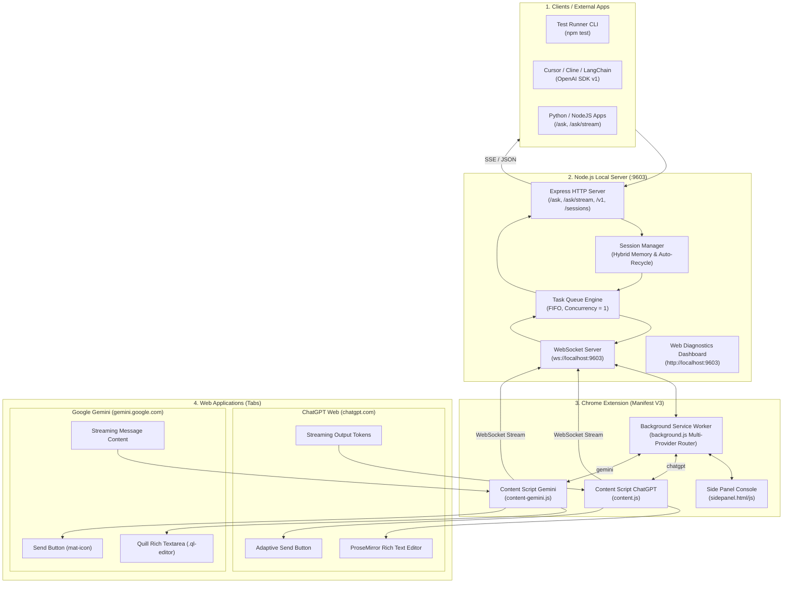
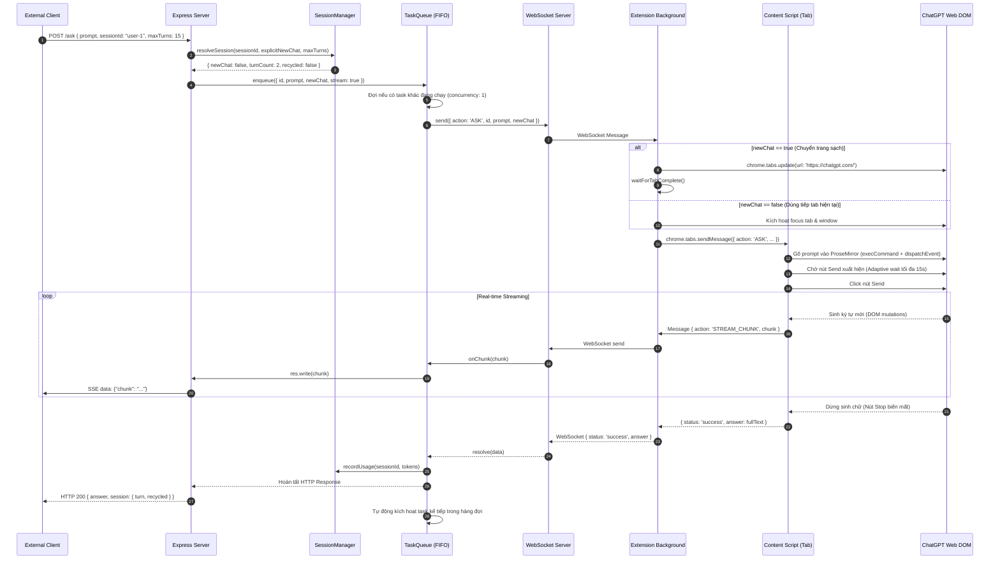

# 📐 ChatGPT Web AI Bridge — Kiến Trúc Kỹ Thuật Chi Tiết (System Architecture Blueprint)

> **Tài liệu tham chiếu chuẩn dành cho Kỹ sư phần mềm & AI Agents**  
> Bản mô tả toàn diện về luồng hoạt động, cấu trúc mã nguồn, cơ chế xử lý ngoại lệ và các bài toán kỹ thuật phức tạp đã được giải quyết trong dự án.

---

## 1. Tổng Quan Kiến Trúc Hệ Thống (High-Level Architecture)

ChatGPT Web AI Bridge là một giải pháp cầu nối cục bộ (Local Bridge) cho phép bất kỳ ứng dụng nào (CLI, Python scripts, Web Apps, Cursor, Cline, LangChain) tương tác với ChatGPT Web (`chatgpt.com`) thông qua tài khoản đang đăng nhập trên trình duyệt Google Chrome mà **không cần OpenAI API Key trả phí**.

### 1.1. Sơ Đồ Kiến Trúc Tổng Thể



---

## 2. Luồng Dữ Liệu Chi Tiết (End-to-End Data Flow)

### 2.1. Vòng Đời Của Một Request



---

## 3. Bản Đồ File & Vai Trò Trách Nhiệm (File Manifest)

### 3.1. Thư mục `server/` (Backend Node.js)

| File | Vai trò & Trách nhiệm |
|---|---|
| [`server/server.js`](file:///e:/code/project/javascript/chatweb-ai-bridge/server/server.js) | **Máy chủ điều phối trung tâm**: Cung cấp các endpoint REST (`/ask`, `/ask/stream`), tương thích OpenAI chuẩn chung (`/v1/chat/completions`), quản lý phiên (`/sessions`), và Web Dashboard tại `localhost:9603`. |
| [`server/constants.js`](file:///e:/code/project/javascript/chatweb-ai-bridge/server/constants.js) | **Bộ hằng số tập trung (Single Source of Truth)**: Chuẩn hóa toàn bộ `PROVIDERS`, `ACTIONS`, `TASK_STATUS`, `QUEUE_EVENTS`, `HTTP_STATUS`, và các schema payload `OPENAI`. |
| [`server/routes/chat-completions.js`](file:///e:/code/project/javascript/chatweb-ai-bridge/server/routes/chat-completions.js) | **Universal Chat Completions Router**: Cung cấp chuẩn chung `/v1/chat/completions` (streaming & non-streaming) và `/v1/models` cho Cursor, Cline, LangChain, Continue.dev (hỗ trợ cả ChatGPT và Gemini). |
| [`server/queue.js`](file:///e:/code/project/javascript/chatweb-ai-bridge/server/queue.js) | **Bộ điều phối hàng đợi đơn nhiệm (Single-Concurrency FIFO Queue)**: Đảm bảo tab trình duyệt chỉ nhận và xử lý đúng 1 câu hỏi tại một thời điểm; gửi tín hiệu `CANCEL_TASK` khi timeout/cancel; quản lý metrics. |
| [`server/session-manager.js`](file:///e:/code/project/javascript/chatweb-ai-bridge/server/session-manager.js) | **Bộ quản lý phiên hội thoại lai (Hybrid Session Manager)**: Ghi nhớ mạch nói chuyện theo `sessionId`, tự động cách ly phiên khi đổi người dùng, và tự động dọn dẹp RAM/DOM bằng cơ chế Auto-Recycle khi chạm ngưỡng `maxTurns`. |
| [`server/tests/test-runner.js`](file:///e:/code/project/javascript/chatweb-ai-bridge/server/tests/test-runner.js) | **Bộ kiểm thử tương tác CLI**: Hỗ trợ 7 kịch bản tự động (`single`, `stream`, `context`, `session`, `stress`, `openai`, `gemini`), tính năng gợi ý lệnh Levenshtein khi gõ sai, Tab Autocomplete, và chế độ terminal chat trực tiếp. |
| [`server/tests/verify-bridge.js`](file:///e:/code/project/javascript/chatweb-ai-bridge/server/tests/verify-bridge.js) | **Bộ kiểm thử tích hợp tự động 6 bài kiểm tra**: Xác thực toàn bộ status metrics, OpenAI API, Gemini API, Streaming SSE, và Concurrency Queue. |
| [`server/tests/README.md`](file:///e:/code/project/javascript/chatweb-ai-bridge/server/tests/README.md) | **Tài liệu hướng dẫn kiểm thử**: Giải thích cặn kẽ mục đích, cơ chế, tiêu chí đánh giá và bảng đo lường của tất cả các bài test. |

### 3.2. Thư mục `extension/` (Google Chrome Extension Manifest V3)

| File | Vai trò & Trách nhiệm |
|---|---|
| [`extension/manifest.json`](file:///e:/code/project/javascript/chatweb-ai-bridge/extension/manifest.json) | **Khai báo tiện ích chuẩn Manifest V3**: Cấu hình permissions (`tabs`, `sidePanel`, `storage`, `alarms`), host permissions (`*://chatgpt.com/*`), phím tắt mở Side Panel (`Ctrl+Shift+B`). |
| [`extension/background.js`](file:///e:/code/project/javascript/chatweb-ai-bridge/extension/background.js) | **Trái tim điều khiển Service Worker**: Duy trì kết nối WebSocket với Local Server; quản lý vòng đời tab ChatGPT; tự động mở tab mới nếu thiếu; tự động chuyển URL về `https://chatgpt.com/` khi có yêu cầu `newChat: true`; relay log sang Side Panel. |
| [`extension/content.js`](file:///e:/code/project/javascript/chatweb-ai-bridge/extension/content.js) | **Script can thiệp DOM trang web ChatGPT**: Đóng gói trong IIFE chống trùng lặp; tự động tìm kiếm ProseMirror; bơm văn bản; xử lý chờ nút Send trễ (Adaptive Wait lên tới 15s); bắt luồng token streaming theo thời gian thực; hiển thị Floating Badge theo dõi trên trang. |
| [`extension/sidepanel.html`](file:///e:/code/project/javascript/chatweb-ai-bridge/extension/sidepanel.html) | **Giao diện bảng điều khiển bên hông (Side Panel)**: Bảng điều khiển thời gian thực nằm cố định cạnh tab ChatGPT, cho phép theo dõi log, test prompt và xem metrics trực tiếp. |
| [`extension/sidepanel.js`](file:///e:/code/project/javascript/chatweb-ai-bridge/extension/sidepanel.js) | **Logic điều khiển Side Panel**: Lắng nghe log từ background worker, hiển thị bộ đếm thời gian, cho phép copy câu trả lời, xóa log và test prompt nhanh. |
| [`extension/sidepanel.css`](file:///e:/code/project/javascript/chatweb-ai-bridge/extension/sidepanel.css) | **Giao diện thẩm mỹ của Side Panel**: Phong cách dark-mode hiện đại, glassmorphism, font JetBrains Mono cho log, animation chuyển động mượt mà. |
| [`extension/popup.html`](file:///e:/code/project/javascript/chatweb-ai-bridge/extension/popup.html) & [`popup.js`](file:///e:/code/project/javascript/chatweb-ai-bridge/extension/popup.js) | **Popup nhanh trên thanh công cụ**: Hiển thị trạng thái kết nối server và nút tắt mở Side Panel nhanh. |

---

## 4. Các Vấn Đề Kỹ Thuật Phức Tạp Đã Được Khắc Phục (Deep Troubleshooting & Solutions)

### 4.1. Vấn đề: Nút Send không xuất hiện ngay sau khi gõ chữ (Delayed Send Button)
* **Nguyên nhân:** Giao diện mới của ChatGPT sử dụng React + ProseMirror có độ trễ bất đồng bộ khi cập nhật trạng thái form (`isSubmitting`, `canSubmit`). Khi gõ text vào, nút Send có lúc mất 1 đến 5 giây mới render ra DOM hoặc chuyển từ trạng thái `disabled` sang `enabled`.
* **Giải pháp đã thực thi trong `content.js`:**
  - Thuật toán **Adaptive Polling (15s)**: Quét liên tục mỗi 150ms để tìm nút Send theo danh sách 8 selectors khác nhau.
  - **MutationObserver chủ động:** Lắng nghe trực tiếp các thay đổi DOM trên form nhập liệu.
  - **Cơ chế Kích Thích Tương Tác (Reactive Nudge):** Sau 1.5s nếu nút Send chưa sáng, script tự động giả lập thêm phím `Space` rồi `Backspace` và dispatch chuỗi event `beforeinput` ➡️ `input` ➡️ `change` để đánh thức React State.
  - **Fallback 3 Tín Hiệu (Triple-Signal Fallback):** Nếu nút Send vẫn bị ẩn nhưng nút Stop đã xuất hiện, hệ thống tự động xác nhận câu hỏi đã được gửi thành công.

### 4.2. Vấn đề: "Identifier 'SELECTORS' has already been declared"
* **Nguyên nhân:** Khi tab ChatGPT tải lại hoặc extension nạp lại script vào tab cũ qua `chrome.scripting.executeScript`, các biến toàn cục ở phạm vi top-level bị khai báo lại, gây ra lỗi `SyntaxError`.
* **Giải pháp đã thực thi trong `content.js`:**
  - Bọc toàn bộ mã nguồn `content.js` vào một **Immediately Invoked Function Expression (IIFE)** khép kín `(() => { ... })()`.
  - Đặt cờ bảo vệ `window.__CHATGPT_BRIDGE_LOADED__ = true`. Nếu phát hiện cờ đã bật, script tự động thoát ngay lập tức, ngăn chặn hoàn toàn lỗi khai báo trùng lặp.

### 4.3. Vấn đề: Lỗi chạy lần 2 trên cùng một tab (`newChat: true` thất bại)
* **Nguyên nhân:** Khi chạy lần 1 thành công, URL của tab ChatGPT chuyển thành `https://chatgpt.com/c/<conversation-id>`. Nếu lần 2 yêu cầu `newChat: true` mà dùng phương pháp click nút "+ New chat" trên DOM, thanh sidebar ChatGPT có thể đang bị thu gọn (collapsed) hoặc giao diện thay đổi khiến click thất bại.
* **Giải pháp đã thực thi trong `background.js`:**
  - Kiểm tra trực tiếp URL của tab: Nếu URL chứa `/c/` hoặc `/g/` và có cờ `newChat: true`, Background Worker sử dụng `chrome.tabs.update(tabId, { url: 'https://chatgpt.com/' })` để điều hướng URL sạch cấp trình duyệt.
  - Chờ hàm `waitForTabComplete()` xác nhận trang đã tải xong 100% rồi mới nạp câu hỏi mới.

### 4.4. Vấn đề: Phình to DOM và Tràn RAM khi hội thoại quá dài (Memory Bloat)
* **Nguyên nhân:** Nếu tái sử dụng 1 cuộc hội thoại cho hàng chục hoặc hàng trăm câu hỏi, số lượng node HTML trong DOM của ChatGPT tăng lên chóng mặt, khiến trình soạn thảo ProseMirror bị giật lag và Chrome ngốn hàng Gigabyte RAM.
* **Giải pháp đã thực thi trong `session-manager.js`:**
  - Thiết lập cơ chế **Auto-Recycle thông minh**: Khi một `sessionId` vượt quá ngưỡng an toàn (mặc định 15 lượt trao đổi), Bridge tự động kích hoạt `newChat: true` để tạo phiên chat mới sạch sẽ, bảo vệ hiệu năng trình duyệt.
  - Tự động cách ly giữa các session khác nhau để chống rò rỉ ngữ cảnh chéo.

### 4.5. Vấn đề: Xung đột khi có nhiều request đồng thời (Concurrency Race Condition)
* **Nguyên nhân:** Tab trình duyệt chỉ có duy nhất 1 ô nhập liệu. Nếu 2 request cùng gõ chữ một lúc, nội dung sẽ bị trộn lẫn và hỏng câu trả lời.
* **Giải pháp đã thực thi trong `queue.js`:**
  - Áp dụng **FIFO Task Queue Engine** với cấu hình cứng `concurrency = 1`.
  - Mọi request đều phải xếp hàng tuần tự. Task sau chỉ được phép đẩy vào tab sau khi task trước đã nhận tín hiệu hoàn tất (`complete`).

### 4.6. Vấn đề: Rào cản bảo mật `TrustedHTML` của Google trên `gemini.google.com`
* **Nguyên nhân:** Google thực thi chính sách `Trusted Types` trên toàn bộ hệ thống web. Mọi thao tác gán chuỗi trực tiếp vào `element.innerHTML` hoặc `element.outerHTML` đều bị trình duyệt chặn và ném `TypeError: Failed to set innerHTML: This document requires 'TrustedHTML' assignment`.
* **Giải pháp đã thực thi trong `content-gemini.js`:**
  - Bơm prompt vào Quill editor qua `document.execCommand('insertText')` (hoàn toàn tương thích và không bị chặn bởi Trusted Types).
  - Bóc tách code block bằng cách tạo `TextNode` chuẩn DOM và dùng `block.replaceWith(textNode)` thay vì ghi đè `.outerHTML`.
  - Toàn bộ Floating Badge được dựng bằng phương thức DOM `document.createElement()`.

### 4.7. Vấn đề: Hủy tác vụ khi Client ngắt kết nối (Client Disconnection & AbortSignal)
* **Nguyên nhân:** Khi người dùng gửi request từ terminal hoặc ứng dụng nhưng bấm Ctrl+C hoặc đóng tab trước khi AI trả lời xong, request bị bỏ rơi nhưng Task Queue vẫn tiếp tục chạy vô ích.
* **Giải pháp đã thực thi trong `queue.js` & `server.js`:**
  - Tích hợp `AbortController` và lắng nghe sự kiện `req.on('aborted')`.
  - Khi client ngắt kết nối, `queue.cancel(taskId)` lập tức gỡ task khỏi hàng đợi hoặc dừng tác vụ đang chạy, giải phóng luồng xử lý cho các request tiếp theo.

### 4.8. Vấn đề: Mất kết quả khi WebSocket rớt đúng lúc AI hoàn tất (Outbox Buffer)
* **Nguyên nhân:** Khi Extension vừa thu được câu trả lời hoàn chỉnh từ DOM nhưng WebSocket với server bị chập chờn hoặc đang trong chu kỳ reconnect, gói tin `TASK_RESULT` có thể bị rớt.
* **Giải pháp đã thực thi trong `background.js`:**
  - Triển khai **Bộ nhớ đệm Outbox Buffer (`pendingResultsBuffer`)**: Nếu socket chưa `OPEN`, gói tin kết quả được lưu vào buffer và tự động xả (`flushPendingBuffer`) ngay khi kết nối lại thành công.
  - Thuật toán **Exponential Backoff kết hợp Jitter**: Tăng dần thời gian chờ kết nối lại (từ 1s đến 10s) kết hợp ngẫu nhiên 500ms để chống hiện tượng dồn cục (thundering herd).

### 4.9. Vấn đề: Quản lý phiên hội thoại đa nền tảng (Provider-Specific Session Tracking)
* **Nguyên nhân:** Nếu request 1 gọi ChatGPT với Session A, sau đó request 2 gọi Gemini với Session B, một bộ quản lý session toàn cục duy nhất sẽ nhầm lẫn là người dùng đổi session và kích hoạt reset tab không cần thiết.
* **Giải pháp đã thực thi trong `session-manager.js`:**
  - Theo dõi `activeSessions` tách biệt hoàn toàn cho từng provider: `{ chatgpt: 'session-A', gemini: 'session-B' }`.
  - Áp dụng cơ chế **LRU Eviction (giới hạn tối đa 2000 sessions)** kết hợp định kỳ dọn dẹp TTL 30 phút, chống rò rỉ bộ nhớ RAM trên server dài hạn.

### 4.10. Vấn đề: Nạp Hình Ảnh Multimodal Vision & Vượt Rào Cản Trusted Clipboard
* **Nguyên nhân:** 
  - Các trang web LLM hiện đại (Google Gemini, ChatGPT) ngăn chặn việc chèn file/ảnh bằng sự kiện nhân tạo (`new ClipboardEvent('paste')` hoặc `DragEvent('drop')`) vì thuộc tính bảo mật `isTrusted === false`.
  - Thẻ `<input type="file">` của các framework Lit/Angular/React thường ghi đè thuộc tính setter khiến việc gán `input.files = dt.files` không phát sinh sự kiện nội bộ.
  - Quá trình tải ảnh lên máy chủ kéo dài hơn 15 giây khiến bộ đếm `safetyTimer` của `InputMutex` dễ bị ngắt sớm.
* **Giải pháp đã thực thi trong `image-handler.js`, `content-gemini.js`, `content.js` & `background.js`:**
  - **Chuẩn hóa Vision Pipeline (`image-handler.js`)**: Trích xuất ảnh từ OpenAI format (`messages[].content`), tải URL hoặc nhận Base64 Data URL, chuyển đổi đồng nhất thành mảng Base64 chuẩn hóa.
  - **Ghi trực tiếp vào System Clipboard của OS**: Yêu cầu quyền `"clipboardWrite"`, `"clipboardRead"` trong Manifest V3. Tiện ích tự động ghi Blob ảnh `image/png` vào clipboard hệ điều hành thông qua `navigator.clipboard.write([new ClipboardItem(...)])`.
  - **Prototype File Setter**: Sử dụng `Object.getOwnPropertyDescriptor(HTMLInputElement.prototype, 'files').set.call(input, dt.files)` và phát sự kiện `change` với cờ `composed: true` để xuyên qua Shadow DOM của Google Lit component.
  - **Dynamic InputMutex Timeout**: Tự động mở rộng thời gian giữ khóa an toàn lên **60 giây** khi phát hiện tác vụ có đính kèm ảnh (`msg.images.length > 0`), đảm bảo thanh tiến trình upload của Gemini hoàn tất 100% trước khi nhấn Send.
  - **UX Dashboard Toàn Diện**: Lắng nghe `paste` trên toàn bộ cửa sổ (`window`) và hỗ trợ Drag & Drop trực tiếp vào Dashboard.

---

## 5. Quy Chuẩn Giao Thức Truyền Tin (Message Protocols)

### 5.1. Server ⟷ Extension WebSocket Contract

#### 1. Lệnh từ Server gửi sang Extension:
```json
{
  "id": "req_1710000000_abc12",
  "action": "ASK",
  "prompt": "Nội dung câu hỏi...",
  "images": ["data:image/jpeg;base64,..."],
  "provider": "gemini",
  "newChat": true,
  "stream": true,
  "timeout": 180000
}
```

#### 2. Streaming Chunk từ Extension gửi về Server:
```json
{
  "id": "req_1710000000_abc12",
  "action": "STREAM_CHUNK",
  "chunk": "ký tự mới",
  "fullText": "toàn bộ đoạn text tính tới hiện tại"
}
```

#### 3. Hoàn tất tác vụ từ Extension gửi về Server:
```json
{
  "id": "req_1710000000_abc12",
  "status": "success",
  "answer": "Nội dung câu trả lời hoàn chỉnh..."
}
```

---

## 6. Hướng Dẫn Bảo Trì & Mở Rộng Sau Này

1. **Khi ChatGPT thay đổi giao diện DOM:**
   - Chỉ cần mở [`extension/content.js`](file:///e:/code/project/javascript/chatweb-ai-bridge/extension/content.js), cập nhật các bộ chọn trong đối tượng `SELECTORS` (ví dụ `editor`, `stopButton`, `assistantMessage`). Các thành phần khác như Server, TaskQueue hay WebSocket không cần thay đổi.
2. **Khi muốn tích hợp vào Tool AI mới:**
   - Chỉ cần trỏ Base URL về `http://localhost:9603/v1` với API Key bất kỳ (ví dụ `Bearer chatgpt-local-bridge`). Hệ thống hoàn toàn tương thích với chuẩn OpenAPI / OpenAI SDK v1.
3. **Khi muốn đổi ngưỡng tự làm mới (Auto-Recycle):**
   - Tùy chỉnh tham số `maxTurns` trong body gọi API hoặc sửa giá trị mặc định trong constructor của [`server/session-manager.js`](file:///e:/code/project/javascript/chatweb-ai-bridge/server/session-manager.js).
